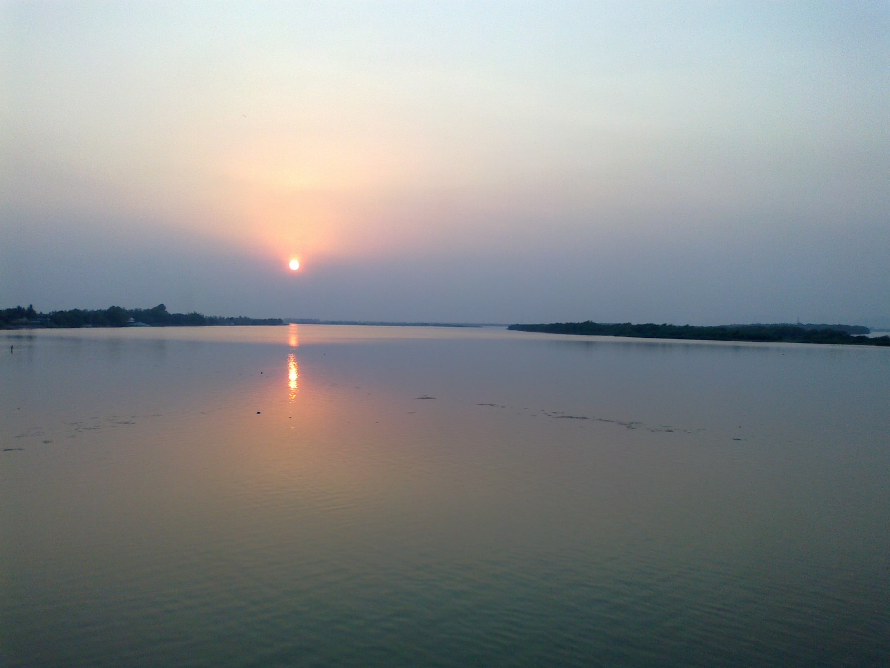

**River krishna**

[Link](https://en.wikipedia.org/wiki/Krishna_River)

The Krishna River originates in the Western Ghats near Mahabaleshwar at an elevation of about 1,300 metres (4,300 ft), in the state of Maharashtra in central India. From Mahabaleshwar it flows to the town of Wai and continues to travel east until it empties into the Bay of Bengal.[7] The Krishna River passes through the Indian states of Maharashtra, Karnataka, Andhra Pradesh, and Telangana.[8] It is around 1,400 kilometres (870 mi) in length, of which 305 km (190 mi) flows in Maharashtra, 483 km (300 mi) in Karnataka and 612 km (380 mi) in Andhra Pradesh.
Tributaries
Panoramic view of Ujjani or Bhima Dam
Tungabhadra Dam near Hosapete
The Krishna River has 13 major tributaries.[9] Its principal tributaries include the Ghataprabha River, Malaprabha River, Bhima River, Tungabhadra River and Musi River.[9] The Tungabhadra River has a catchment area of 71,417 km2 (27,574 sq mi) and a length of 531 km (330 mi).[9] The Bhima River is the longest tributary of the Krishna River.[7] It has a total length of 861 km (535 mi) and catchment area of 70,614 km2 (27,264 sq mi).[9]Three tributaries Panchganga, Warna and Yerla meet Krishna river near Sangli. These places are considered very holy. It is said that Lord Dattatreya spent some of his days at Audumber on the banks of river Krishna.Kudalasangama, North Karnataka
Kudalasangama[10] (also written as Kudala Sangama is located about 15 kilometres (9.3 mi) from the Almatti Dam in Bagalkot district of Karnataka state. The Krishna and Malaprabha rivers merge here. The Aikya Mantapa or the holy Samādhi of Basavanna, the founder of the Lingayat sect of Hindu religion along with Linga, which is believed to be self-born (Swayambhu), is here and river flow east towards Srisailam (another pilgrim center) Andhra Pradesh.
Sangameswaram of Kurnool district in Andhra Pradesh is a famous pilgrim center for Hindus where Tungabhadra and Bhavanasi rivers join the Krishna river. The Sangameswaram temple is now drowned in the Srisailam reservoir, and visible for devotees only during summer when the reservoir's water level comes down.[11][citation needed]
Krishna Basin
Drainage Basin of Krishna
The Krishna Basin extends over an area of 258,948 km2 (99,980 sq mi) which is nearly 8% of the total geographical area of the country. This large basin lies in the states of Karnataka (113,271 km2), Telangana, Andhra Pradesh (76,252 km2) and Maharashtra (69,425 km2).[12] It is the fifth largest basin in India.[7]
Most of this basin comprises rolling and undulating country, except for the western border, which is formed by an unbroken line of the Western Ghats. The important soil types found in the basin are black soils, red soils, laterite and lateritic soils, alluvium, mixed soils, red and black soils and saline and alkaline soils.
An average annual surface water potential of 78.1 km3 has been assessed in this basin. Out of this, 58.0 km3 is utilizable water.[13] Culturable area in the basin is about 203,000 km2 (78,000 sq mi), which is 10.4% of the total cultivable area of the country. As the water availability in the Krishna river was becoming inadequate to meet the water demand, Godavari River is linked to the Krishna river by commissioning the Polavaram right bank canal with the help of Pattiseema lift scheme in the year 2015 to augment water availability to the Prakasam Barrage in Andhra Pradesh.[14] The irrigation canals of Prakasam Barrage form part of National Waterway 4. The Krishna-Godavari delta known as "Rice Granary of India."[15])

***
**Table**

*Water flow to the sea*

| Water year      | 03-04 | 04-05 | 05-06 |
|-----------------|-------|-------|-------|
| Water out flows | 5     | 14    | 113   |
*** 
1. Ganga
2. Godavari
*** 
References

[Main link](https://en.wikipedia.org/wiki/Krishna_River)

[River basins](https://indiawris.gov.in/wiki/doku.php?id=river_basins)

